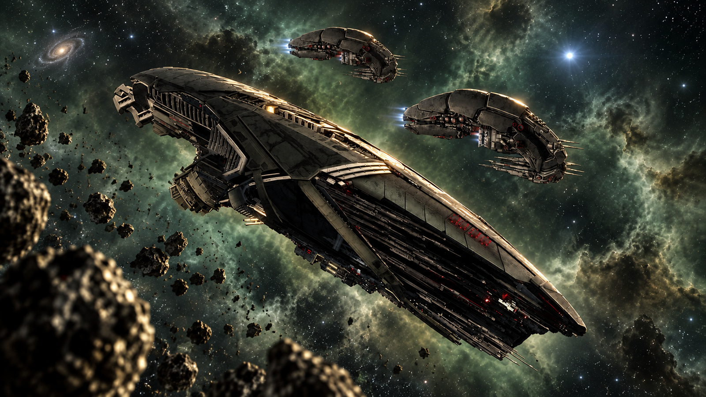

# Xenon Pressure for X4: Foundations

<p align="center">
  
</p>

The Xenon are held back by a handful of numbers. Their faction logic wants exactly seven shipyards and seven wharfs — four without the Split and Terran DLC — and rolls a five percent chance every minute or two to start a missing one. Their jobs cap how many N, M, P, K and I exist at once. Their ships cost about twice what their economy feeds them. Their miners carry 9 500 units and turn to fight whatever shoots them.

This mod puts the live numbers on sliders — station targets, a ratio of stations to sectors held, how big an invasion fleet gets and how much of it may be newly built, how many groups go after stations in contested space, and whether they raid beyond their borders — makes the miners' reaction to an attack a setting, and ships tuned quotas, cheaper hulls and a bigger hold as static patches. It replaces **Xenon Hell** and **AI Xenon Miners**; disable both, they patch the same nodes.

**Requires X4: Foundations 9.00.** No DLC required, and no hard dependency on other mods. Works on an existing savegame.

## Install

```bash
./install.sh
```

The helper copies `extension/` into the game's `extensions/<extension-id>`
directory, using the id in `extension/content.xml`. It searches the usual Steam layouts and additional library folders. To choose an installation:

```bash
X4_PATH="/path/to/X4 Foundations" ./install.sh
```

Restart X4 after installing or updating. To remove the manual installation:

```bash
./install.sh --uninstall
```

## The sliders

| Slider                        | Range      | Vanilla | What it is                                                                                                                                                                                                                 |
|-------------------------------|------------|---------|----------------------------------------------------------------------------------------------------------------------------------------------------------------------------------------------------------------------------|
| **Sectors per shipyard**      | 0 – 5      | 0 (off) | sets `$DesiredShipyards` in the Xenon faction logic to one shipyard per this many sectors the Xenon own or contest, rounded up; 0 leaves the vanilla target — 7 with Split Vendetta and Cradle of Humanity, 4 without them |
| **Sectors per wharf**         | 0 – 5      | 0 (off) | the same for `$DesiredWharfs`                                                                                                                                                                                              |
| **Constructions in progress** | 0 – 10     | 0 (off) | how many shipyards and wharfs may be under construction at once before another is started; 0 is no limit                                                                                                                   |
| **Build chance**              | 1 – 100 %  | 5 %     | the `chance` on `$ShipyardsToBuild` / `$WharfsToBuild` — per 1–2 minute evaluation, whether a missing station is started this time                                                                                         |
| **Invasion fleet size**       | 50 – 300 % | 100 %   | scales `$MinimumStrength` / `$MaximumStrength` of a Xenon invasion — the strength it gathers before moving and the ceiling it may request up to                                                                            |
| **Invasion build share**      | 0 – 100 %  | 25 %    | `$RequestStrengthAllowance` — the share of each invasion group that may be newly built rather than pulled off patrol                                                                                                       |
| **Station attack groups**     | 1 – 6      | 2       | `$MaxAttackEnemyStationSubGoals` — how many groups may be attacking enemy stations in a Xenon or contested sector at once                                                                                                  |
| **Long range raids**          | on / off   | off     | fills the manager's `$ExpeditionEnemies` with every faction, so expeditions may target sectors beyond the Xenon's gate neighbours                                                                                          |
| **Miner behaviour**           | 0 – 2      | 0       | what a Xenon miner or energy hauler does when shot at: **0** turns to fight, **1** keeps flying and neither fights nor flees, **2** flees at once, no laser towers                                                         |

Every default is vanilla except **Miner behaviour**, which defaults to **2**.

### The static changes

| Patch                                                           | Change                                                                                                                         |
|-----------------------------------------------------------------|--------------------------------------------------------------------------------------------------------------------------------|
| `assets/units/size_m/macros/storage_xen_m_miner_01_a_macro.xml` | Xenon M miner cargo 9 500 → **22 500**. Both miner hulls share this storage macro                                              |
| `libraries/jobs.xml`                                            | Xenon job quotas raised — see the table below                                                                                  |
| `libraries/wares.xml`                                           | Build resources halved for the N, M, P, K, I and both M miners; resources and build time halved for every Xenon station module |

These are library and macro files, read once when the game starts, so they cannot be sliders. Change the numbers in the patch files and reinstall. Quotas fill as the job engine spawns ships; the cargo change reaches every existing miner on the next load.

| Job                                           | Vanilla                           | Now        |
|-----------------------------------------------|-----------------------------------|------------|
| `xenon_free_miner_m_mineral`                  | galaxy 56, cluster 8              | 100, 18    |
| `xenon_free_miner_m_mineral_local`            | galaxy 36, cluster 6              | 64, 11     |
| `xenon_free_trader_m_energy`                  | galaxy 42, cluster 6              | 90, 12     |
| `xenon_carrier_patrol_xl_border_cluster`      | galaxy 1, maxgalaxy 1             | 5, 5       |
| `xenon_carrier_patrol_xl_zone_defence`        | galaxy 2                          | 5          |
| `xenon_destroyer_patrol_xl_cluster`           | galaxy 6, maxgalaxy 18, cluster 3 | 21, 42, 5  |
| `xenon_destroyer_patrol_xl_defence`           | galaxy 6, cluster 4               | 10, 5      |
| `xenon_destroyer_patrol_xl_comp`              | galaxy 2, maxgalaxy 11, cluster 2 | 5, 18, 5   |
| `xenon_fighter_patrol_s_zone`                 | galaxy 59, maxgalaxy 94, zone 1   | 70, 141, 2 |
| `xenon_frigate_patrol_m_zone_everywhereelse`  | galaxy 29, maxgalaxy 69, sector 2 | 61, 122, 3 |
| `xenon_scout_patrol_s`                        | galaxy 8, maxgalaxy 16, cluster 2 | 12, 24, 3  |
| `xenon_fighter_s_deepspace_single` / `_group` | galaxy 15 / 7                     | 23 / 11    |
| `xenon_destroyer_escort_xl`                   | wing 2                            | 3          |
| `xenon_fighter_escort_s_frigate` / `_patrol`  | wing 4 / 2                        | 5 / 3      |

`maxgalaxy` is the count past which the job engine starts *removing* ships, and it defaults to twice `galaxy`. Every raised `galaxy` here stays at or below its `maxgalaxy`; Xenon Hell shipped 21 destroyers against a cap of 18 and 5 border carriers against a cap of 1, which is a spawn-and-cull loop.

| Ship                           | Vanilla EC / ore / silicon | Now                |
|--------------------------------|----------------------------|--------------------|
| N `ship_xen_s_fighter_01_a`    | 41 / 34 / 35               | 20 / 17 / 17       |
| M `ship_xen_s_fighter_02_a`    | 48 / 40 / 40               | 24 / 20 / 20       |
| P `ship_xen_m_fighter_01_a`    | 94 / 79 / 79               | 47 / 39 / 39       |
| `ship_xen_m_miner_01_a`        | 85 / 71 / 72               | 42 / 35 / 36       |
| `ship_xen_m_miner_solid_01_a`  | 85 / 71 / 72               | 42 / 35 / 36       |
| I `ship_xen_xl_carrier_01_a`   | 6049 / 5070 / 5090         | 3000 / 2500 / 2500 |
| K `ship_xen_xl_destroyer_01_a` | 4560 / 2189 / 1403         | 2280 / 1095 / 702  |

The station modules follow the same rule, resources and build time both halved. The three the Xenon share with the Commonwealth — the S/M fabrication bay their wharf plan uses and the two Argon defence modules in both plans — have a separate `xenon` production method, and only that one is touched; the Commonwealth recipes are as vanilla.

| Module                                           | Vanilla EC / ore / silicon, time | Now                       |
|--------------------------------------------------|----------------------------------|---------------------------|
| `module_xen_build_xl_01` L/XL fabrication bay    | 4866 / 12301 / 7186, 954 s       | 2433 / 6150 / 3593, 477 s |
| `module_xen_build_m_01`, `module_xen_build_s_01` | 2750 / 6952 / 4062, 539 s        | 1375 / 3476 / 2031, 269 s |
| `module_gen_build_dockarea_m_01` (xenon method)  | 6620 / 6952 / 4062, 539 s        | 3310 / 3476 / 2031, 269 s |
| `module_xen_def_base_01` station base            | 1391 / 3515 / 2054, 2726 s       | 695 / 1757 / 1027, 1363 s |
| `module_xen_dock_m_01`                           | 363 / 918 / 536, 1424 s          | 181 / 459 / 268, 712 s    |
| `module_xen_stor_01`                             | 153 / 387 / 226, 387 s           | 76 / 193 / 113, 193 s     |
| `module_xen_prod_energycells_01`                 | 562 / 963 / 963, 378 s           | 281 / 481 / 481, 189 s    |
| `module_arg_def_disc_01` (xenon method)          | 196 / 496 / 290, 384 s           | 98 / 248 / 145, 192 s     |
| `module_arg_def_tube_01` (xenon method)          | 170 / 431 / 252, 334 s           | 85 / 215 / 126, 167 s     |

### What the numbers mean in play

**Sectors per shipyard / wharf** replaces the fixed vanilla target with one that follows how much space the Xenon hold. The target is a floor, not a cap: the faction logic counts what the Xenon own — including wrecks and constructions — and when the count is below it rolls the build chance; it never tears down a surplus. The library already keeps the list of sectors the faction owns or contests, `$ClaimedSectors`, and the target becomes that count divided by the slider, rounded up — one per five sectors at 5, one in every sector at 1. With around thirty Xenon sectors, 5 gives six, 3 gives ten, 1 gives thirty. New stations go into sectors where the Xenon already have stations, one shipyard and one wharf per sector at most, preferring a sector where one stood before; the seven vanilla sites are the god-seeded ones and anything past them is built from the Xenon construction plan. Since the logic places at most one of each type per sector, 1 is the practical ceiling anyway, and raising the
target does not conjure a station in a sector they have lost. When the Xenon lose sectors the target falls with them; at 0 the vanilla number applies and they rebuild towards seven regardless.

**Constructions in progress** is the throttle for the ratio sliders. Nothing in vanilla stops the faction logic from starting a new site every cycle while it is below target, so at one shipyard per sector it will open thirty construction sites in half an hour and its miners and energy haulers will spread their deliveries across all of them. With a cap, a new shipyard or wharf is only started while fewer than that many are still under construction, so the few that are open get fed and finish. Xenon stations need no construction vessel — only wares — so this is the one thing that decides how fast they come up.

**Build chance** is what turns a target into a replacement. At 5 % a Xenon shipyard you kill takes 20–40 minutes on average before the replacement is even started, and then it has to be built. At 100 % the construction starts on the next evaluation. This slider is the same for shipyards and wharfs; it does not touch other factions.

**Invasion fleet size** and **Invasion build share** are the two numbers behind how hard a Xenon attack lands. The Xenon use the same invasion machinery as every other faction, and their aggression mood is already at its maximum, so there is no "more aggressive" mood to set. What the mood sets is a strength the invasion must gather in its staging area before it moves — for the Xenon, at least two destroyers' worth, or 0.8 times what they believe defends the target — and a ceiling of twice that. The fleet size slider scales both. The catch is that an invasion that cannot reach its strength within an hour gives up, and by default only a quarter of each group may be newly built; the rest is commandeered from patrols. Raise the build share along with the fleet size, or the bigger fleets will mostly fail to assemble. New ships are still ordered through the job system, so the quotas in `libraries/jobs.xml` — raised by this mod — remain the ceiling on how many destroyers and fighters can
exist.

**Station attack groups** governs a different fight: the one for sectors the Xenon already hold or contest. Every such sector runs a hold-space goal that forms groups to attack enemy stations inside it, two at a time at the Xenon's aggression. More groups means more of your — or the Commonwealth's — stations in Xenon space come under attack at once.

**Long range raids** turns on expeditions, which the Xenon never get in vanilla: invasions against sectors that are not gate neighbours, owned by any faction with a faction manager. Vanilla caps them at two at a time; they gather for up to two hours, hold the target for an hour, build no station and request no new ships, then retreat. It is the closest thing to the Xenon showing up somewhere unexpected.

**Miner behaviour** covers both Xenon miner hulls, and the energy haulers, because the Xenon "trader" job flies the miner hull too. 0 is vanilla: a Xenon miner, like every Xenon ship, counter-attacks. 1 is what Xenon Hell did — it neither fights nor flees, and keeps mining or delivering under fire. 2 is what AI Xenon Miners did — it flees whatever its morale and shields say, and does not deploy laser towers as it goes. Only the ship's own fight-or-flight decision changes; it still calls for help in every mode.

## How it works

Four patches read the settings at the moment the vanilla script evaluates, so nothing has to be applied to a running game; one setting is a manager variable and is written instead.

| Patch                              | Change                                                                                                                                                                                                                                                                                                                                                          |
|------------------------------------|-----------------------------------------------------------------------------------------------------------------------------------------------------------------------------------------------------------------------------------------------------------------------------------------------------------------------------------------------------------------|
| `md/factionlogic_stations.xml`     | Counts shipyard and wharf constructions in the vanilla sector pass; right before the vanilla `$ShipyardCount lt $DesiredShipyards` check, sets `$DesiredShipyards` for `faction.xenon` from the sector ratio when it is on, holds it at the count while the construction cap is reached, and swaps the literal `chance="5"` for a variable; the same for wharfs |
| `md/factiongoal_invade_space.xml`  | After the vanilla strength gate is computed, scales `$MinimumStrength` and `$MaximumStrength` for Xenon goals; replaces the two `/ 4` build allowances with the build share                                                                                                                                                                                     |
| `md/factiongoal_hold_space.xml`    | After the mood chain, overrides `$MaxAttackEnemyStationSubGoals` for Xenon goals                                                                                                                                                                                                                                                                                |
| `aiscripts/interrupt.attacked.xml` | Computes a mode for the attacked ship, then gates the vanilla *flee* and *fight* branches on it and adds `mode != 2` to the laser tower condition of the flee order                                                                                                                                                                                             |

The station targets live in the vanilla library `Manage_Stations`, which every faction manager instantiates and re-runs every one to two minutes. The override is inserted **before** the count check rather than after the DLC patch marker, so it lands after every DLC addition whatever the load order, and its last fallback is the DLC-adjusted vanilla value rather than a literal. The `chance` attribute is an expression in the game's schema — vanilla already uses `chance="$DebugChance"` in the same file — so a variable goes in without restructuring the block. The sector ratio reads `$ClaimedSectors`, the list the same library fills in the same cycle.

The invasion and hold-space numbers are locals of a goal instance, recomputed on every evaluation, so they can only be reached by a patch in the place they are computed. Each patch is a single Xenon-gated block; every other faction runs the vanilla code path.

**Long range raids** is different: `$ExpeditionEnemies` lives on the Xenon faction manager cue and is read on every goal evaluation, so it is written, not patched — on every savegame load, through a child cue that waits for the manager to exist, and again when the option changes. The list is taken from `global.$FactionManagers`, so it only ever names factions that actually run faction logic in this game, whatever DLC is installed.

The miner reaction is decided inside the vanilla `AttackHandler`, an interrupt every mining and trade order includes. The patch sets `$DrJeleXenonMinerBehaviour` as the first condition — 0 for anything that is not a Xenon `shiptype.miner` — then prepends one `check_value` to each branch: the flee block fails in mode 1, its inner alternatives pass unconditionally in mode 2, and the fight block only passes in mode 0. Vanilla's own morale, skill and shield tests are untouched underneath.

Every setting is read defensively — the global the options menu writes, else the table the configuration cue publishes, else the vanilla value — so a configuration that fails to load degrades to stock Xenon behaviour rather than breaking them. All selectors match exactly one node in the 9.00 files, also with the Split, Terran and Pirate DLC patches to the same files applied first.

## Configuring without the menu

The in-game sliders need [SirNukes Mod Support APIs](https://steamcommunity.com/sharedfiles/filedetails/?id=2042901274); without it the mod runs off the constants at the top of `extension/md/drjele_xenon_pressure.xml`, which are re-read on every savegame load. Editing one and reloading is enough — no new game.

Each can also be overridden at runtime without touching the file:

```xml

<set_value name="global.$DrJeleXenonSectorsPerShipyard" exact="3"/>
<set_value name="global.$DrJeleXenonSectorsPerWharf" exact="3"/>
<set_value name="global.$DrJeleXenonMaxConstructions" exact="3"/>
<set_value name="global.$DrJeleXenonBuildChance" exact="50"/>
<set_value name="global.$DrJeleXenonFleetSize" exact="200"/>
<set_value name="global.$DrJeleXenonBuildShare" exact="75"/>
<set_value name="global.$DrJeleXenonStationAttackGroups" exact="4"/>
<set_value name="global.$DrJeleXenonLongRangeRaids" exact="1"/>
<set_value name="global.$DrJeleXenonMinerBehaviour" exact="1"/>
```

`$DrJeleXenonLongRangeRaids` is only picked up on the next load or when the option changes, because it is applied by writing the manager variable; the others are read live. Turn on **Debug logging** in the options, or set `$DebugChance` to 100 in the configuration cue, to have every evaluation written to the debug log.

The static numbers — cargo, quotas, resources — are edited in the patch files under `extension/` and need a reinstall and a restart.

## Debugging

Add this to the game's launch options — Steam, right click X4, **Properties → General → Launch Options**:

```
-debug all -logfile debuglog.txt
```

The log lands next to your savegames: `$HOME/.config/EgoSoft/X4/<userid>/debuglog.txt` on Linux, `Documents\Egosoft\X4\<userid>\debuglog.txt` on Windows. If Steam is installed as a snap it runs the game with a redirected home, which puts both under `~/snap/steam/common/`. `all` turns on every one of the engine's debug channels; a narrower filter only makes sense once you know which channel a message uses, and the engine prints `Unknown debug filter` for a name it does not recognise.

The mod itself is silent by default. To hear from it, turn on **Debug logging** in **Options → Extension Options → Xenon Pressure** (needs SirNukes Mod Support APIs); without the API, set `$DebugChance` to `100` in the configuration cue of `extension/md/drjele_xenon_pressure.xml`, re-run `./install.sh` and restart. Either way, every evaluation is written out:

```
DrJele Xenon Pressure: sectors per shipyard 0, sectors per wharf 0, max constructions 0, build chance 5, fleet size 100, build share 25, station attack groups 2, long range raids 0, miner behaviour 2
DrJele Xenon Pressure: long range raids 0, expedition enemies []
DrJele Xenon Pressure: 6 shipyards, desires 7 (31 claimed sectors, 0 per shipyard, 2 of 0 constructions), build chance 5
DrJele Xenon Pressure: 6 wharfs, desires 7 (31 claimed sectors, 0 per wharf, 2 of 0 constructions), build chance 5
DrJele Xenon Pressure: invasion of Hatikvah's Choice I wants strength 126 to 252 (fleet size 100)
```

A patch whose XPath finds nothing is reported without any of that, at startup, by file and selector — so inspect `debuglog.txt` after startup for patch errors mentioning the extension id or the patched filenames. A quiet log alone does not prove that the extension loaded; enable its debug output to confirm that its configuration and evaluated settings are present.

## Removing it

Take the extension out and the sliders stop being applied. `$ExpeditionEnemies` keeps whatever was last written into it — an empty list unless long range raids were on — because it is the manager's own variable; turn the option off before removing the mod, or reinstall it with the option off, to clear it. Stations the Xenon built past the vanilla target stay. Ships past the vanilla quota stay until the job engine trims them back. The miners' hold shrinks back to 9 500 on the next load, and any cargo above that is lost. Slider values persist in the options API's own storage, which is shared between savegames, and are ignored once the mod is gone. Nothing else of this mod persists; it stores no state of its own.

## Status

Working, verified in game on 9.00, on a savegame several hundred hours old with Split Vendetta, Cradle of Humanity and the other DLC installed — the case the whole design is built around. Settings for the run: one shipyard and one wharf per sector, five constructions in progress, build chance 100 %, fleet size 300 %, build share 75 %, miner behaviour 2. Every check below was read out of the savegame itself.

| Check                     | Result                                                                                                                                                                                                        |
|---------------------------|---------------------------------------------------------------------------------------------------------------------------------------------------------------------------------------------------------------|
| Options menu              | all nine options register, and every slider's value lands in its global; values arrive as floats and are cast, so the Xenon manager holds `$DesiredShipyards = 28`, not `6.4`                                 |
| Sector ratio              | 28 sectors owned or contested, one per sector → targets 28 / 28; at one per five sectors → 6 / 6                                                                                                              |
| Build chance              | at 100 % a missing shipyard was started on the first evaluation after the change, at 5 % the vanilla 1–2 minute cycle applies                                                                                 |
| Station building          | 20 shipyards and 21 wharfs started in the first 35 minutes of game time at one per sector; with halved module costs 8 shipyards and 7 wharfs finished within the next hour of play                            |
| Constructions in progress | the counter reads 30 with 15 shipyards and 15 wharfs under construction, and the cap of 5 pins the target at the count so nothing more is started; other factions carry the counter at 0 and stay vanilla     |
| Invasions                 | four Xenon invasion goals carry `$MinimumStrength = $MaximumStrength = 138`, three times vanilla's 46; one reached its beachhead and one retreated during the run                                             |
| Miner behaviour           | the mode variable is computed on every attacked ship's order script — 0 on every non-Xenon ship seen; no Xenon miner was attacked during the run, so mode 2 itself is unobserved                              |
| Patches                   | every selector matches exactly one node in the 9.00 files with the Split, Terran and Pirate DLC patches applied first, the merged scripts validate against the game's schemas, and no patch error is reported |
| Script errors             | none                                                                                                                                                                                                          |

What the run does not measure: the station attack group cap, whose goal-local variable does not survive an evaluation and so cannot be read from a save, and long range raids, which were left off. Both are the same one-node patch and manager-variable patterns as the verified settings.

## Publishing to the Steam Workshop

Install **X Tools** (Steam app 282160) and keep Steam running and logged in with an account that owns X4. On Linux, install Proton as well; on Windows, run the helper from Git Bash, MSYS or Cygwin.

```bash
./publish.sh publish
./publish.sh update "what changed"
```

Use `publish` once, then `update` with a change note. `X4_PATH`,
`X_TOOLS_PATH` and `PROTON_PATH` override automatic discovery. The staging location must contain an `extensions` directory.

The first upload records the numeric id in `steam/workshop-id`; retain that file for future updates. The readable id in the repository's `content.xml`
stays unchanged. After publishing, open the printed Workshop URL, complete any required Steam agreement and choose the item's visibility. Avoid keeping both the manual installation and a subscription to the same mod enabled.

Update the manifest version and release date together with `CHANGELOG.md`
when releasing. See [Development](DEVELOPMENT.md) for staging, platform and release conventions.

## Development

See [DEVELOPMENT.md](DEVELOPMENT.md) for setup, code style, validation and release conventions.

## Legal

MIT, see [`LICENSE`](LICENSE). Non-commercial fan project; X4: Foundations belongs to Egosoft GmbH and this project is not affiliated with or endorsed by Egosoft.
